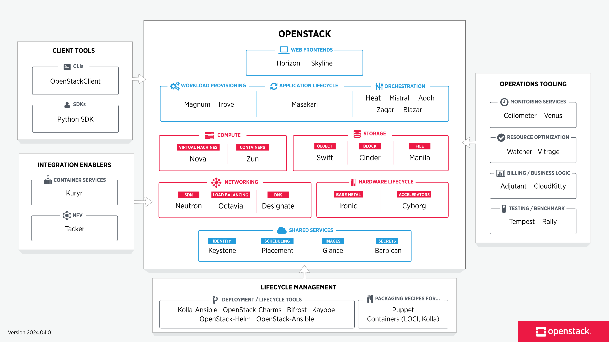
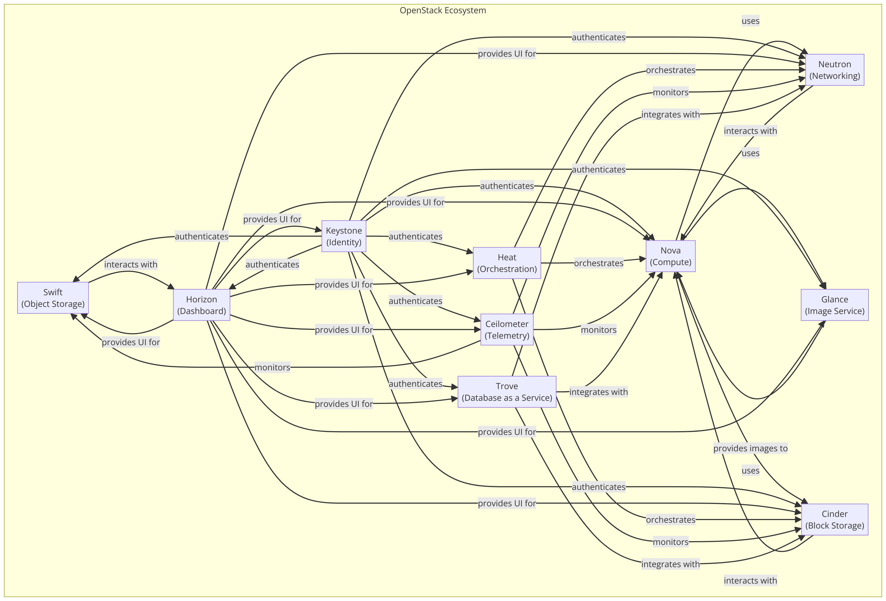

# 2부. 오픈스택 주요 컴포넌트

- OpenStack은 클라우드 인프라를 구축하고 관리하기 위한 오픈 소스 플랫폼
- 다양한 컴포넌트(서비스)를 통해 컴퓨팅, 네트워킹, 스토리지, 아이덴티티 및 이미지 관리 등의 기능을 제공
- 플러그 앤 플레이 방식으로 설계되어 있어, 사용자가 필요에 따라 선택적으로 구성하고 확장 가능
- 또한 모듈식 구조로 각각의 서비스가 독립적으로 작동하면서 서로 통합 가능

- 핵심 컴포넌트
  - Nova(Compute)
    - OpenStack의 컴퓨팅 엔진으로 가상 머신의 생명 주기 관리 담당
    - 사용자가 클라우드 내에서 VM을 생성, 스케줄링, 삭제하는 기능을 제공
  - Neutron(Networking)
    - 클라우드 내 네트워킹 기능을 관리
    - 가상 네트워크, 서브넷, 라우터 등을 설정하고 관리
  - Cinder(Block Storage)
    - 블록 스토리지 서비스를 제공하여 VM에 영구적인 스토리지를 붙일 수 있게 함
    - 데이터베이스, 파일 시스템 등을 위한 스토리지 볼륨을 관리
  - Swift(Object Storage)
    - 객체 스토리지 서비스로, 대규모의 비정형 데이터를 저장할 수 있음
    - 정적 파일, 미디어 파일 등으로 저장하고, HTTP로 접근할 수 있게 함
  - Glance(Image Service)
    - 가상 머신 이미지를 관리하는 서비스
    - VM 이미지의 등록, 저장, 검색 및 기능을 제공
  - Keystone(Identity Service)
    - OpenStack 내의 모든 인증 및 권한 부여 작업을 담당
    - 사용자와 서비스 간의 인증을 관리
- 추가 컴포넌트
  - Horizon
    - OpenStack의 대시보드로, 웹 기반의 사용자 인터페이스를 제공하여 OpenStack 서비스 관리를 지원
  - Heat
    - 오케스트레이션 서비스
    - 템플릿을 사용하여 애플리케이션 스택의 자원을 자동으로 생성하고 관리
  - Ceilometer
    - 텔레메트리 서비스(알림 등의 서비스)
    - 클라우드 사용에 대한 메트릭 수집, 모니터링 및 빌링을 위한 데이터를 제공
  - Trove
    - 데이터베이스 서비스
    - 관계형 및 비관계형 데이터베이스 인스턴스를 관리 기능 지원

---

## 1. 인증 서비스(Keystone)

- 오픈스택의 핵심 인증 서비스로 사용자 인증 및 서비스 간 권한 부여를 담당

### 1.1 인증과 권한 부여

#### 인증(Authentication)

- 역할
  - Keystone의 인증 과정은 사용자나 서비스가 시스템에 접근을 요청할 때, 그들의 신원을 확인하는 과정
  - 사용자가 올바른 신원 증명(일반적으론 ID와 PW)을 제공하면, Keystone은 이를 검증하고 요청에 대한 승인을 결정
- 토큰 기반 인증
  - Keystone은 성공적인 인증 후에 토큰 발급
  - 발급된 토큰은 사용자가 다른 오픈스택 서비스에 대한 요청을 할 때 사용하며, 사용자의 신원과 권한 수준을 나타냄
  - 토큰은 유효 기간이 있으며 기간이 지나면 재인증 필요

#### 권한 부여(Authorization)

- 역할
  - 인증 과정을 끝낸 사용자나 서비스에 대해, Keystone은 해당 사용자가 수행할 수 있는 작업의 범위를 결정
  - 사용자에게 할당된 역할과 정책에 기반하여 이루어짐
- 역할 기반 접근 제어(RBAC)
  - Keystone은 역할 기반 접근 제어 모델을 사용하여 권한을 관리
  - 사용자는 하나 이상의 역할을 가질 수 있으며, 각 역할은 특정 리소스에 대한 접근 권한을 정의
  - 예) `admin` 역할을 가진 사용자는 시스템의 모든 리소스를 관리할 수 있지만, `member` 역할을 가진 사용자는 제한된 리소스에만 접근 가능
- 정책 관리
  - Keystone은 정책 파일을 통해 세밀한 권한 부여 규칙을 정의할 수 있음
  - 파일 형식은 JSON 또는 YAML 형식으로 작성
  - 서비스별로 다양한 작업에 대한 접근 권하을 구체적으로 설정할 수 있음

### 1.2 Keystone의 아키텍처

#### 주요 구성 요소

1. Keystone 서버
- RESTful API 인터페이스를 제공
- 인증 요청을 처리하고, 유효한 요청에 대해 토큰을 발급
- 사용자, 역할, 프로젝트 등의 관리 기능을 수행

2. 토큰 관리 서비스
- 인증이 성공적으로 이루어졌으면, Keystone은 접근 토큰을 발급
- 발급된 토큰이 사용자가 오픈스택의 다른 서비스에 접근할 때 사용되며, 사용자의 권한을 나타냄
- 토큰은 일정 시간이 지나면 만료되며, 이때는 새로운 토큰을 요청해야 함

3. 서비스 카탈로그
- Keystone은 오픈스택 클라우드 내의 모든 서비스와 그 API 엔드포인트에 대한 정보를 관리하는 서비스 카탈로그를 제공
- 사용자나 서비스가 필요한 리소스를 찾을 때 이 카탈로그를 조회

4. 정책 관리
- Keystone은 Json 또는 YAML 형식의 정책 파일을 통해 권한 부여 정책을 관리
- 여기서 정책은 특정 작업을 수행할 수 있는 사용자나 역할을 정의함
- 정책 관리를 통해 리소스에 대한 접근을 세밀하게 제어할 수 있음

5. 백엔드 스토리지
- 사용자 정보, 역할, 토큰 등 Keystone에서 관리하는 데이터는 백엔드 스토리지에 저장
- Keystone은 SQL 데이터베이스(예: MySQL, PostgreSQL)를 기본 스토리지로 사용하며, LDAP 디렉토리 서비스와의 통합도 지원

#### 아키텍처 특징

- 모듈성
  - Keystone의 아키텍처는 모듈식으로 설계되어 있어, 다양한 백엔드 스토리지와 인증 메커니즘을 지원
  - 이를 통해 확장성과 유연성이 향상
- 확장성
  - 대규모 클라우드 환경에서도 Keystone은 높은 확장성을 제공
  - 효율적인 토큰 관리와 분산된 아키텍처를 통해 다수의 인증 요청 처리 가능
- 보안
  - SSL/TLS를 통한 데이터 암호화, 정기적인 토큰 만료, 정책 기반의 접근 제어 등을 통해 클라우드 인프라스트럭처의 보안을 강화

  
### 1.3 사용자 및 서비스 관리

#### 사용자 관리

1. 사용자 생성
- Keystone에서는 관리자가 새로운 사용자 계정을 생성할 수 있음
- 각 사용자는 고유한 신원 정보(예. ID, PW 등)와 연결

2. 역할 할당
- 사용자에게 하나 이상의 역할을 할당하고, 그들이 수행할 수 있는 작업의 범위를 정의
- 역할은 특정 권한을 나타냄

3. 프로젝트 및 도메인
- 사용자는 하나 이상의 프로젝트 또는 테넌트에 속할 수 있음
- 프로젝트는 리소스의 그룹을 격리하는 단위이며, 도메인은 프로젝트와 사용자를 포함하는 더 큰 관리 단위
- 이를 통해 리소스 접근을 조직적으로 관리할 수 있음

#### 서비스 관리

1. 서비스 등록
- 오픈스택에서 제공하는 다양한 서비스는 Keystone 서비스 카탈로그에 등록되어야 함
- 서비스 등록 과정에서는 서비스의 이름, 타입, API 엔드포인트 등의 정보가 지정

2. 엔드포인트 관리
- 각 서비스에 대한 API 엔드포인트는 Keystone을 통해 관리
- 엔드포인트는 일반적으로 퍼블릭(외부 접근 가능), 인터널(내부 네트워크 접근), 어드민(관리 작업용) 세 가지 유형으로 구분

3. 서비스 카탈로그
- 클라우드 환경 내에서 사용 가능한 모든 서비스와 그 엔드포인트를 목록화 함
- 사용자와 다른 서비스는 서비스 카탈로그를 조회하여 필요한 서비스의 API에 접근 가능

#### 정책 관리

- 정책 파일은 JSON 또는 YAML 형식의 정책 파일을 통해 서비스별 접근 정책을 정의
- 정책 파일은 특정 작업을 수행할 수 있는 사용자나 역할을 지정
- 정책 관리를 통해 리소스 접근을 세밀하게 제어할 수 있으며, 보안성을 강화

---

## 2. 대시보드(Horizon)

- 오픈스택의 공식 웹 기반 대시보드로, 사용자가 GUI를 통해 클라우드 리소스를 쉽게 관리하고 모니터링할 수 있도록 함

### 2.1 웹 기반 인터페이스

#### 주요 특징 및 기능

- 직관적인 사용자 인터페이스: 몇 번의 클릭만으로 가상 머신, 네트워크, 스토리지 볼륨 등의 리소스 생성 및 관리 가능
- 리소스 관리: 오픈스택의 전체 리소스를 관리할 수 있음
- 역할 기반 접근 제어: Horizon은 Keystone과 통합하여 역할 기반 접근 제어(RBAC)를 지원
- 실시간 모니터링 및 보고: 현재 상태와 성능 지표를 실시간으로 모니터링할 수 있는 기능 제공
- 플러그인 확장성: 추가 기능이나 사용자 정의 대시보드를 쉽게 통합할 수 있도록 지원
- 다국어 지원

### 2.2 사용자 경험 및 관리

#### 사용자 인터페이스 디자인

- 직관적인 디자인
- 네비게이션

#### 리소스 관리 및 모니터링

- 리소스 생성 및 관리
- 실시간 모니터링

#### 사용자 권한 및 접근 제어

- 역할 기반 접근 제어(RBAC)
- 사용자 및 프로젝트 관리

#### 사용성 향상을 위한 기능

- 플러그인 및 확장 기능
- 다국어 지원

### 2.3 대시보드 커스터마이징

#### 커스터마이징 가능한 요소

1. 테마 및 브랜딩: 테마를 조직의 브랜드와 일치시키기 위해 색상, 로고, 폰트 등을 커스터마이징할 수 있음
2. 네비게이션 및 메뉴 구성
3. 대시보드 위젯 및 패널 추가
4. 사용자 정의 페이지

#### 커스터마이징 방법

1. 테마 수정: CSS와 HTML 템플릿을 통해 할 수 있음
2. 패널 및 위젯 개발: Django 기반임으로 이를 토대로 개발하고 통합
3. 플러그인 활용

## 3. 컴퓨트 서비스(Nova)

- 오픈스택의 핵심 컴포넌트 중 하나로, 클라우드 컴퓨팅 환경에서 가상 머신의 생명 주기를 관리

### 3.1 아키텍처와 기능

#### 주요 구성 요소

1. Nova API 서버(nova-api): 사용자와 다른 오픈스택 서비스로부터의 API 요청을 받아 처리
2. Nova 스케줄러(nova-scheduler): VM 인스턴스를 생성할 적절한 컴퓨트 노드를 결정하는 역할
3. Nova 컴퓨트(nova-compute)
- 실제 컴퓨트 노드에서 실행되며, VM의 생명 주기 관리 작업을 수행
- 하이퍼바이저와 통신하여 VM의 생성, 실행, 중지 등을 관리
4. Nova Conductor(nova-conductor)
- 데이터베이스와 직접적인 통신을 처리하며, nova-compute 서비스와 데이터베이스 간의 중개자 역할
- 컴퓨트 노드와 데이터베이스 간의 직접적인 연결을 피하고, 보안성과 확장성을 향상시킴
5. 메시지 큐: Nova 컴포넌트 간의 비동기 통신을 위해 메시지 큐(RabbitMQ, AMQP 등)를 사용

#### 주요 기능

1. VM 인스턴스 관리: Nova는 VM 인스턴스의 생성, 삭제, 재시작, 마이그레이션 등의 작업 관리
2. 리소스 할당: Nova는 CPU, 메모리, 스토리지 등의 컴퓨터 리소스를 VM 인스턴스에 동적으로 할당 -> 클라두으 환경에서 리소스를 유연하게 관리할 수 있음
3. 네트워킹 통합: Nova는 Neutron(오픈스택의 네트워킹 서비스)과 통합되어, VM 인스턴스에 대한 복잡한 네트워킹 구성을 지원
4. 이미지 관리: Nova는 Glance(오픈스택의 이미지 서비스)와 통합되어, VM 생성 시 사용할 수 있는 디스크 이미지를 관리
5. 보안 그룹과 키 페어: VM의 보안을 관리하기 위해 보안 그룹(방화벽 규칙의 집합)과 키 페어(SSH 키) 제공

### 3.2 하이퍼바이저와 연동

#### 하이퍼바이저의 역할

- 리소스 분할: 물리적 하드웨어 리소스(CPU, 메모리, 스토리지 등)를 여러 VM 사이에서 분할하여 할당
- 격리: 각 VM은 독립적인 실행 환경을 갖게 되며, 다른 VM의 작업에 영향을 받지 않음
- 관리 및 제어: VM의 생성, 실행, 중지, 삭제 등을 관리하며, 네트워킹 및 스토리지 구성 등을 제어

#### Nova와 하이퍼바이저의 연동

1. 하이퍼바이저 선택 및 구성
- Nova에 사용할 하이퍼바이저를 선택하고 구성
- KVM, Xen, VMware vSphere, Micosoft Hyper-V 등 다양한 하이퍼바이저를 지원

2. 드라이버를 통한 통신
- Nova는 각 하이퍼바이저와 통신하기 위해 특정 드라이버를 사용
- 예를 들어, KVM 하이퍼바이저의 경우 Libvirt 드라이버를 사용하며, 이 드라이버는 Nova와 KVM 사이의 인터페이스 역할을 함

3. VM 생성 및 관리
- 사용자의 VM 생성 요청 -> Nova가 하이퍼바이저의 드라이버를 통해 해당 요청 전달 -> 하이퍼바이저가 물리적 리소스를 할당하고 VM을 실행
- 이후 Nova는 VM의 생명 주기(시작, 중지, 재시작, 삭제 등) 관리

4. 리소스 모니터링
- Nova는 하이퍼바이저를 통해 VM의 성능 지표와 리소스 사용량을 모니터링
- 이 정보는 리소스 할당 결정과 시스템 최적화에 사용될 수 있음

### 3.3 가상 머신 관리

#### VM 생성

- 이미지 선택: Glance에서 제공하는 OS 이미지 또는 사용자가 직접 제공한 이미지를 선택하는 것으로 시작
- 플레이버 선택: VM에 할당할 리소스의 양(CPU, 메모리, 스토리지 등)을 정의하는 플레이버 선택
- 네트워킹 설정: VM이 접속할 가상 네트워크 설정, Neutron을 통해 VM에 공개 IP 주소를 할당하거나 내부 네트워크에 연결할 수 있음
- 보안 그룹 설정: VM의 네트워크 트래픽을 제어하기 위한 보안 그룹을 설정, 특정 포트의 인바운드 및 아웃바운드 트래픽에 대한 규칙 설정
- 키 페어 할당: SSH 접속을 위한 키 페어를 VM에 할당, VM에 원격 접속 가능

#### VM 모니터링 및 관리

- 상태 모니터링: Nova는 VM의 현재 상태(활정, 중지, 오류 등)와 성능 지표(CPU 사용량, 메모리 사용량)를 모니터링, 이는 Horizon 대시보드나 CLI를 통해 확인 가능
- 스냅샷 생성
- 재시작 및 중지
- 크기 조정 및 마이그레이션: VM의 리소스를 증가시키거나 감소시키는 조정 작업 가능, VM을 다른 컴퓨트 노드로 마이그레이션 가능

#### VM 삭제

- 삭제하면 VM과 관련된 모든 리소스(디스크 볼륨, 네트워킹 설정 등)도 함께 제거

## 4. 이미지 서비스(Glance)

- 가상 머신 이미지의 등록, 저장, 검색 및 관리를 담당

### 4.1 이미지 관리의 개요

#### 주요 기능

1. 이미지 저장 및 관리: VM 이미지를 저장하고, 이미지에 대한 메타데이터를 관리
2. 이미지 형식 지원: RAW, VHD(Azure용), VMDK(VMware용), qcow2(KVM용), OVA 등이 포함
3. 이미지 공유 및 배포
4. 버전 관리 및 스냅샷
5. 보안: 이미지는 디스크에 암호화되어 저장 가능, SSL/TLS를 통해 안전하게 전송됨

#### 구성 요소

1. Glance API: 클라이언트 요청을 받아 처리하는 RESTful 인터페이스 제공
2. Glance Registry: 이미지 메타데이터를 저장하고 조회하는 서비스
3. 백엔드 스토리지: 로컬 파일 시스템, 오브젝트 스토리지(Swift), 블록 스토리지(Cinder) 등 다양하게 지원

### 4.2 기능과 구조

#### 주요 기능

1. 이미지 저장
2. 이미지 메타데이터 관리
3. 이미지 버전 관리 및 스냅샷
4. 이미지 공유 및 배포

#### 구조 및 구성 요소

1. Glance API(glance-api)
2. Glance Registry(glance-registry)
3. 백엔드 스토리지
4. 메타데이터 데이터베이스

### 4.3 이미지 저장 및 관리

#### 이미지 저장

1. 업로드: Glance API를 통해 진행
2. 스토리지 백엔드: 로컬 파일 시스템, 오브젝트 스토리지(Swift), 블록 스토리지(Cinder) 중 선택 가능
3. 암호화

#### 이미지 관리

1. 메타데이터 관리
2. 이미지 공유 및 접근 제어
3. 이미지 버전 관리 및 스냅샷
4. 이미지 삭제 및 정리
